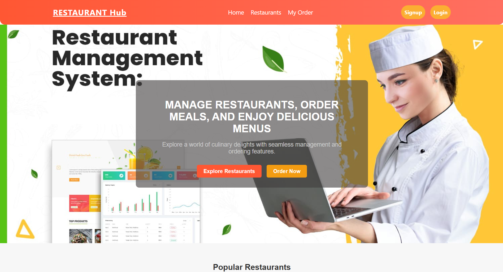
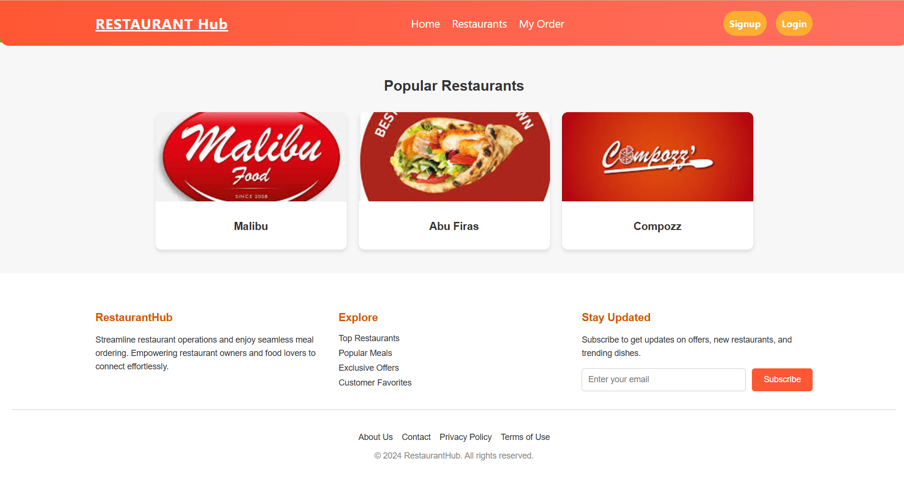
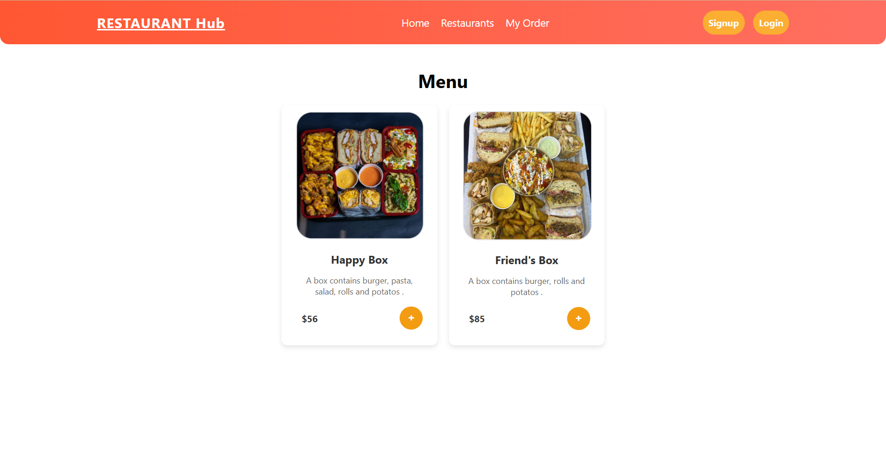
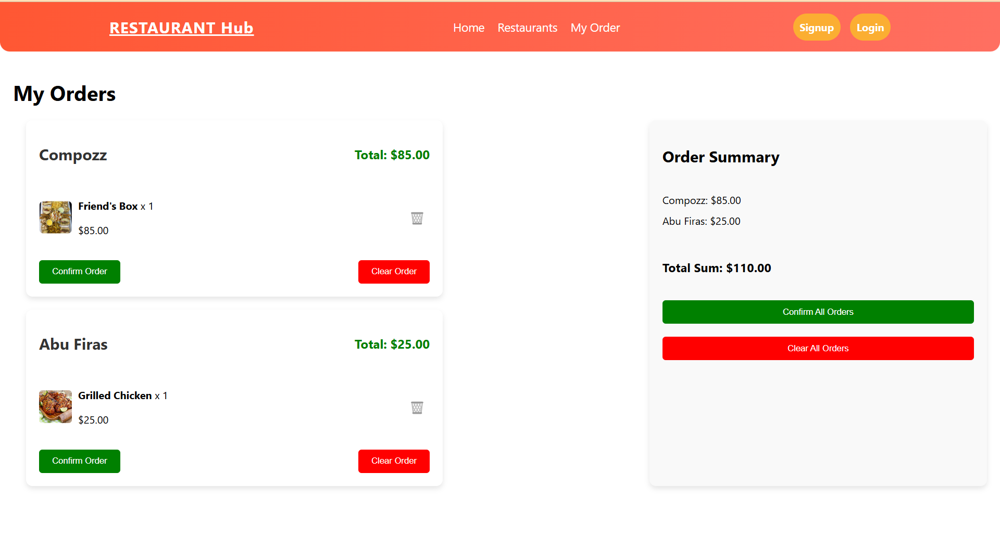

# Restaurant Management System

## Table of Contents

- [Introduction](#introduction)
- [Features](#features)
- [Technologies Used](#technologies-used)
- [Usage](#usage)
- [Screenshots](#screenshots)
- [Installation](#installation)
- [Future Enhancements](#future-enhancements)

## Introduction

The **Restaurant Management System** is a full-stack web application built using the MERN stack. It allows users to explore multiple restaurants, browse their menus, place orders for desired meals, and enjoy an intuitive interface for managing orders. The application is designed to provide a seamless experience for both users and restaurant administrators.

---

## Features

- **Restaurant Exploration**: Browse through a list of available restaurants.
- **Menu Browsing**: View detailed menus for each restaurant.
- **Order Placement**: Select meals and place orders easily.
- **Authentication**: User and admin roles with secure JWT-based authentication.
- **Admin Dashboard**: Manage restaurants, menus, and user orders.
- **Responsive Design**: Optimized for both desktop and mobile devices.

---

## Technologies Used

### Frontend:
- React
- React Router
- Redux (for state management)
- Bootstrap / TailwindCSS

### Backend:
- Node.js
- Express.js
- MongoDB (Database)
- Mongoose (Object Data Modeling)

### Tools and Libraries:
- Axios
- JWT (for authentication)
- Bcrypt.js (for password hashing)

---


## Usage

1. **Sign up or log in**:
   - Users can create an account or log in.
   - Admins can access a dedicated dashboard for managing the application.

2. **Browse restaurants**:
   - Explore available restaurants and view their menus.

3. **Place orders**:
   - Add desired meals to your order and complete the checkout process.

4. **Admin actions**:
   - Add, edit, or delete restaurants and menu items.
   - View and manage customer orders.

---


## Screenshots

### 1. Home Page


### 2. Restaurants Page


### 3. Restaurant Menu


### 4. Order Page



---

## Future Enhancements

- Add real-time order tracking using WebSockets.
- Enable payment gateway integration.
- Implement advanced search and filtering for restaurants and menus.
- Add reviews and ratings for restaurants and menu items.

---

## Installation

### Prerequisites:
- Node.js (v16 or higher)
- MongoDB (Local or cloud-based)
- Git

### Steps:
1. Clone the repository:
   ```bash
   git clone https://github.com/yourusername/restaurant-management-system.git
   ```

2. Navigate to the project folder:
   ```bash
   cd Restaurant
   ```

3. Install dependencies for both frontend and backend:
   ```bash
   cd frontend && npm install
   cd ../backend && npm install
   ```

4. Set up environment variables:
   - Create a `.env` file in the `backend` directory and add the following:
     ```env
     MONGO_URI=mongodb://localhost:27017/restaurantDB
     JWT_SECRET=your_secret_key
     PORT=5000
     ```

5. Start the application:
   ```bash
   # Start the backend
   cd backend && npm start

   # Start the frontend
   cd frontend && npm start
   ```

   ```

6. Open your browser and navigate to `http://localhost:3000`.

---

